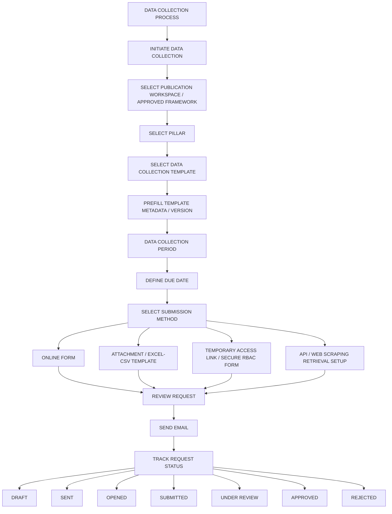
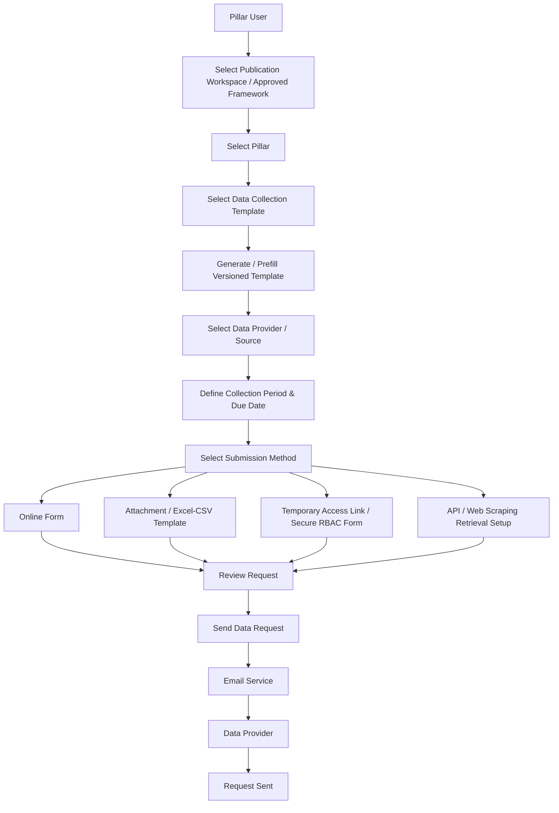
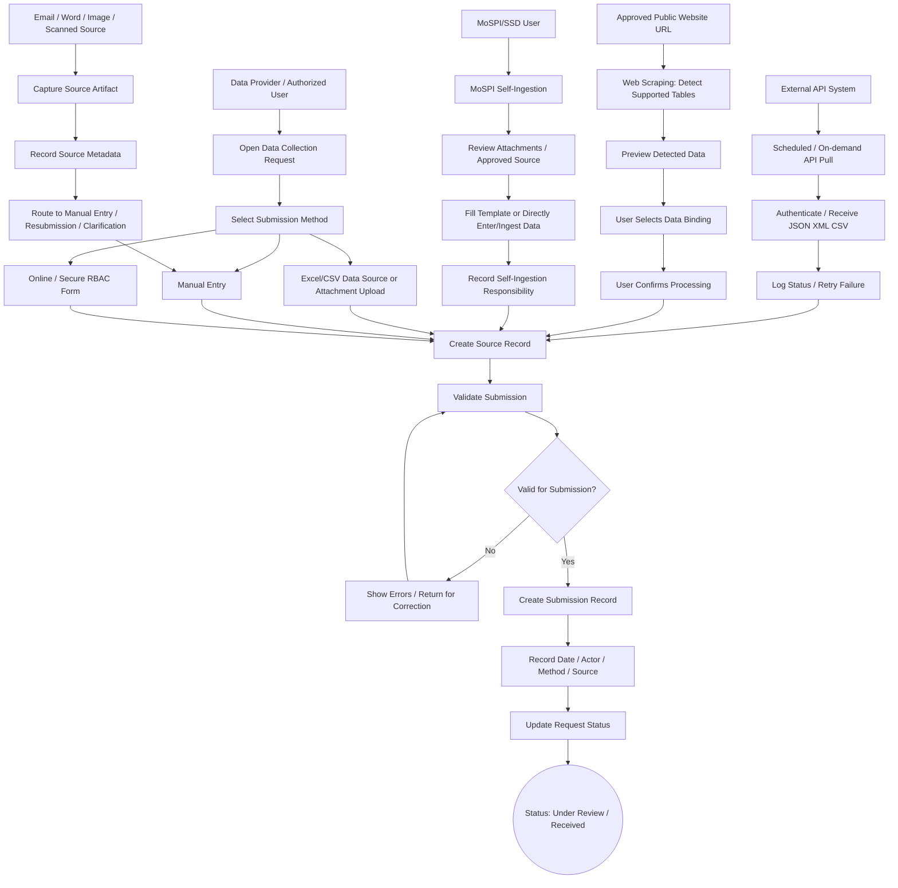
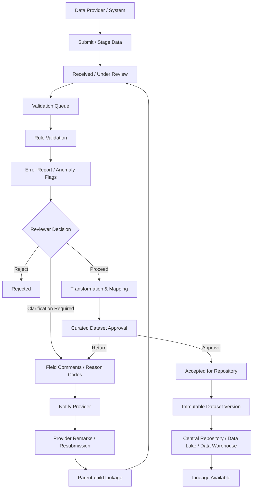
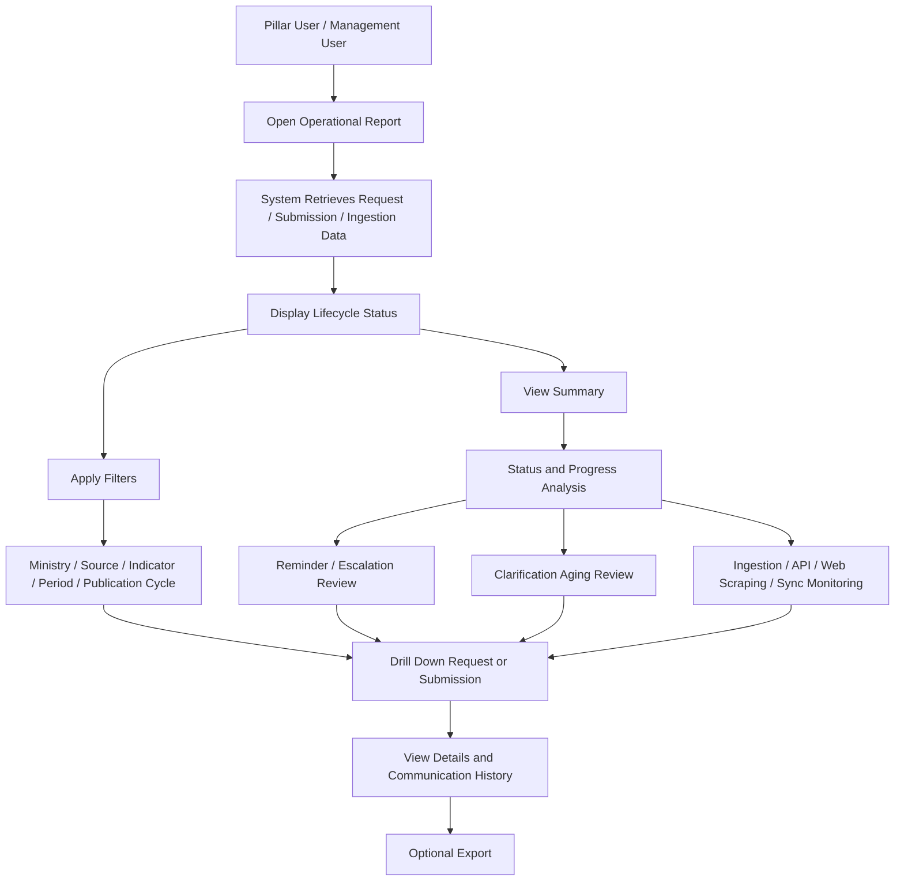
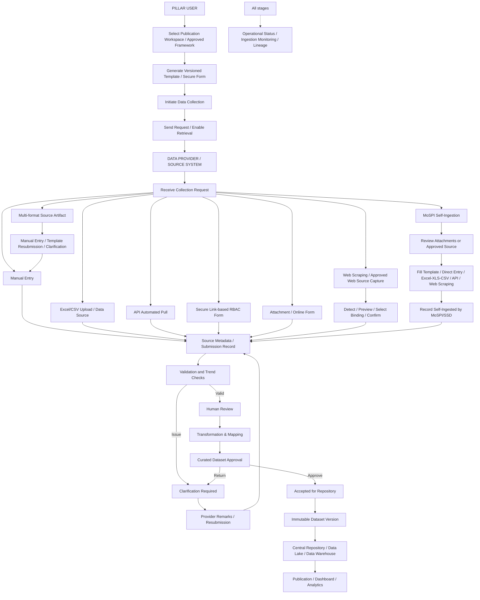
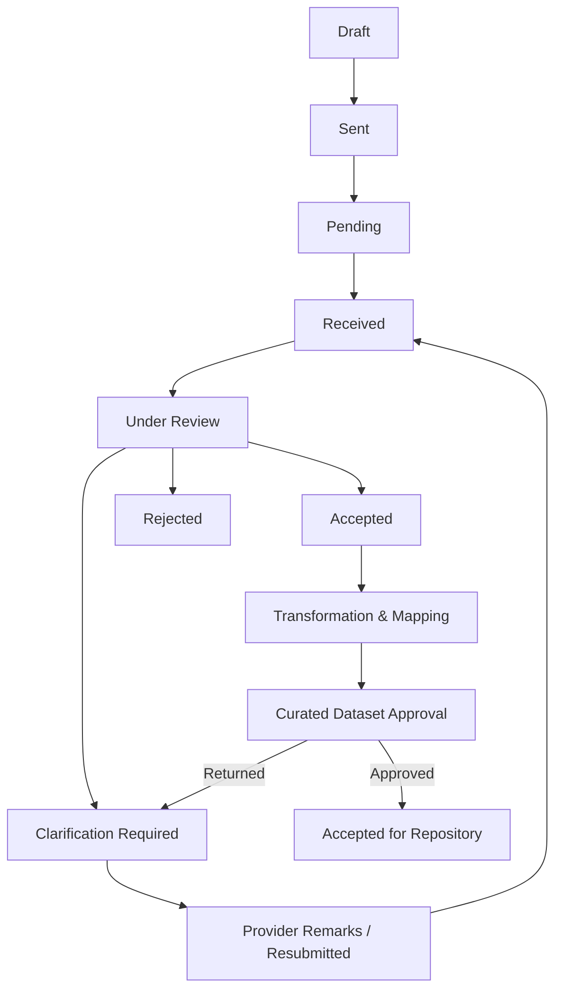

**4.2.2 Data Collection Process**

**Functional Requirements**

This section details the functional requirements for the Data Collection Process, aligned with the Data Ingestion & Processing Module requirements. The requirements capture the actor, purpose, system capabilities, and system guarantees for data collection, ingestion, validation, processing, curation, repository storage, and downstream consumption.

**Data Ingestion & Processing Module**

The Data Ingestion & Processing module is the foundational data entry layer. It supports four primary acquisition modes: manual entry, Excel/CSV upload, API-based automated pull, and secure link-based RBAC forms for external data providers including ministries and states. The module also supports MoSPI Self-Ingestion, where authorized MoSPI/SSD users prepare, enter or ingest data themselves when ministries submit attachments instead of filled templates, or when MoSPI directly collects reliable data from approved sources. The module ensures all incoming data is ingested, validated through automated checks and human review, processed/transformed, versioned, and stored in the central data lake before it is made available to other modules.

The complete data processing workflow is: **Ingestion -> Automated Validation -> Human Review / Clarification -> Transformation and Mapping -> Curated Dataset Approval -> Repository Storage -> Publication / Dashboard / Analytics Consumption**.

**4.2.2.1 Initiate Data Collection**

**A. Functional Purpose**

The **Initiate Data Collection** functionality enables the Pillar User to initiate a data collection request from the system by selecting the required data collection template, defining the applicable data provider/source, and sending the request through email.

The request shall be linked to the applicable publication workspace/cycle and MoSPI-approved indicator framework wherever the collection is part of an official publication lifecycle. Collection templates shall be generated from approved publication indicators, metadata, source ministry/department, reporting year, periodicity and functional nodal officer-approved formats.

The functionality supports initiation of data collection requests for configured submission, access and source-retrieval mechanisms, including:

1. **Online Form** - The data provider receives a link to an online data collection form and submits the required information directly through the application.
2. **Attachment / Excel-CSV Template Submission** - The data provider receives the data collection request through email and submits the requested data using the prescribed attachment or Excel/CSV template.
3. **Temporary Contributor Access / Secure RBAC Form** - The system generates secure, one-time, hash-only access links for external data providers to ensure secure, tokenless entry without exposing raw credentials. This includes token expiry monitoring and administrative resend/revoke controls.
4. **System-enabled Source Retrieval** - Where configured, the request may support API retrieval or approved public website URL/web scraping-based data capture, subject to ingestion validation and user confirmation rules.

The system shall maintain the complete lifecycle of the data collection request, including request creation, email dispatch, submission status, reminders, and subsequent review.

**B. Business Definitions**

| **Term** | **Definition** |
| --- | --- |
| Pillar | A configured business/functional area for which data is collected. |
| Pillar User | Authorized user responsible for initiating, monitoring, reviewing and approving data collection activities for a Pillar. |
| Data Provider | Internal or external party responsible for providing the requested data. |
| Data Collection Template | Configured structure defining the fields, dimensions, indicators and data requirements to be submitted. |
| Data Collection Request | A system-generated request created by a Pillar User to obtain data from a Data Provider. |
| Online Form | Application-based form through which a Data Provider directly enters and submits data. |
| Attachment | File submitted by the Data Provider containing the requested data. |
| Collection Period | The reporting period for which data is being requested. |
| Due Date | The deadline by which the Data Provider is expected to submit the requested data. |
| Request Status | Current lifecycle state of a data collection request. |
| Publication Workspace / Cycle | Approved publication instance and reporting cycle for which data is being collected. |
| Approved Indicator Framework | MoSPI-approved indicator framework/version used as the authoritative basis for official collection cycles. |
| Template Version | Versioned template structure issued to the Data Provider and linked to the resulting submission. |

**C. Functional Hierarchy Diagram**

**Diagram type:** Functional hierarchy diagram  
**Diagram ID:** DIA-DCP-001  
**Diagram:**

**D. Ownership, Approval Authority, Actors and Access**

| **Functional Area** | **Owning Division** | **Operational Ownership** | **Approval Authority** |
| --- | --- | --- | --- |
| Data Collection Initiation | Pillar | Pillar User | Pillar Manager / Authorized Approver |
| Data Collection Template Selection | Pillar | Pillar User | Pillar Manager |
| Data Provider Selection | Pillar | Pillar User | Pillar Manager |
| Email Initiation | Pillar | Pillar User | Not Applicable |
| Collection Request Monitoring | Pillar | Pillar User | Pillar Manager |

**Actors:**

* Pillar User
* Data Provider
* System/Application
* Email Service

**E. Functional Requirements**

|  |  |  |  |  |  |  |  |
| --- | --- | --- | --- | --- | --- | --- | --- |
| **Requirement ID** | **Module Name** | **Requirement Description** | **Priority** | **Stakeholder** | **Business Rule ID** | **Acceptance Criteria ID** | **Dependency ID** |
| FR-DCP-001 | Initiate Data Collection | The system shall allow an authorized Pillar User to initiate a data collection request. | High | Pillar User | BR-DCP-001 | AC-DCP-001 | DEP-DCP-001 |
| FR-DCP-002 | Initiate Data Collection | The system shall allow the Pillar User to select the applicable Pillar. | High | Pillar User | BR-DCP-002 | AC-DCP-002 | DEP-DCP-002 |
| FR-DCP-003 | Initiate Data Collection | The system shall allow the Pillar User to select an approved Data Collection Template. | High | Pillar User | BR-DCP-003 | AC-DCP-003 | DEP-DCP-003 |
| FR-DCP-004 | Initiate Data Collection | The system shall allow the Pillar User to select one or more Data Providers/Sources. | High | Pillar User | BR-DCP-004 | AC-DCP-004 | DEP-DCP-004 |
| FR-DCP-005 | Initiate Data Collection | The system shall allow the user to define the collection period and due date. | High | Pillar User | BR-DCP-005 | AC-DCP-005 | DEP-DCP-005 |
| FR-DCP-006 | Initiate Data Collection | The system shall support configured submission, access and source-retrieval mechanisms, including Online Form, Attachment/Excel-CSV Template submission, Secure Link-based RBAC Form, API retrieval setup, and approved web scraping retrieval setup. | High | Pillar User | BR-DCP-006 | AC-DCP-006 | DEP-DCP-003 |
| FR-DCP-007 | Initiate Data Collection | The system shall generate and send a data collection email to the selected Data Provider. | High | Pillar User | BR-DCP-007 | AC-DCP-007 | DEP-DCP-006 |
| FR-DCP-008 | Initiate Data Collection | The system shall generate a unique Data Collection Request ID. | High | System | BR-DCP-008 | AC-DCP-008 | DEP-DCP-001 |
| FR-DCP-009 | Initiate Data Collection | The system shall generate secure hash-only temporary access links. | High | System | BR-DCP-010 | AC-DCP-009 | DEP-DCP-001 |
| FR-DCP-010 | Initiate Data Collection | The system shall record the request status and timestamp of request initiation. | High | System | BR-DCP-009 | AC-DCP-010 | DEP-DCP-001 |
| FR-DCP-011 | Initiate Data Collection | The system shall support secure link-based RBAC forms as a configured acquisition mechanism for external data providers. | High | SSD Department User / Data Provider | BR-DCP-011 | AC-DCP-011 | DEP-DCP-001 |
| FR-DCP-012 | Initiate Data Collection | The system shall generate standardized collection templates/forms based on approved publication indicators, metadata, source ministry, reporting year, periodicity and functional nodal officer-approved formats. | High | SSD Department User | BR-DCP-012 | AC-DCP-012 | DEP-DCP-007 |
| FR-DCP-013 | Initiate Data Collection | The system shall pre-fill collection templates/forms with applicable indicator, unit, source, periodicity, reporting period and publication-cycle metadata. | High | SSD Department User / Data Provider | BR-DCP-013 | AC-DCP-013 | DEP-DCP-007 |
| FR-DCP-014 | Initiate Data Collection | The system shall maintain version history and change history for issued templates and shall link the issued template version to every submission. | High | System | BR-DCP-014 | AC-DCP-014 | DEP-DCP-007 |
| FR-DCP-015 | Initiate Data Collection | The system shall support bilingual data collection templates/forms where applicable. | Medium | Data Provider / SSD Department User | BR-DCP-015 | AC-DCP-015 | DEP-DCP-008 |
| FR-DCP-016 | Initiate Data Collection | The system shall link every applicable collection request to a publication workspace/cycle covering data collection, ingestion, drafting, review, approval, generation and dissemination. | High | SSD Department User | BR-DCP-016 | AC-DCP-016 | DEP-DCP-009 |
| FR-DCP-017 | Initiate Data Collection | The system shall use only MoSPI-approved indicator frameworks and framework versions for official collection cycles. | High | SSD Department User / System | BR-DCP-017 | AC-DCP-017 | DEP-DCP-010 |

**F. Business Rules**

| **Business Rule ID** | **Business Rule** |
| --- | --- |
| BR-DCP-001 | Only authorized Pillar Users shall be allowed to initiate data collection requests. |
| BR-DCP-002 | A Pillar User shall only be able to initiate collection for Pillars to which they have access. |
| BR-DCP-003 | Only active and approved Data Collection Templates shall be available for selection. |
| BR-DCP-004 | Only active Data Providers/Sources shall be available for selection. |
| BR-DCP-005 | The due date shall not be earlier than the request initiation date. |
| BR-DCP-006 | The submission, access or source-retrieval mechanism shall be determined based on the configured Data Collection Template, approved source and business requirement. |
| BR-DCP-007 | An email shall only be sent when all mandatory request information has been completed. |
| BR-DCP-008 | Each collection request shall have a unique system-generated Request ID. |
| BR-DCP-009 | The system shall maintain an audit trail for request creation and email dispatch. |
| BR-DCP-010 | The system shall enforce token secrecy for temporary access links; expired or administratively revoked links must immediately block access. |
| BR-DCP-011 | Link-based RBAC forms shall be enabled only as per approved template, source, role and publication-cycle configuration. |
| BR-DCP-012 | Collection templates shall be indicator-linked, source-specific, period-specific and based on functional nodal officer-approved formats. |
| BR-DCP-013 | Pre-filled template metadata shall not be editable by unauthorized Data Providers unless the template configuration permits it. |
| BR-DCP-014 | Issued template versions shall remain linked to submissions and shall not be overwritten. |
| BR-DCP-015 | Bilingual labels shall follow approved translation/localization configuration. |
| BR-DCP-016 | Collection requests shall be linked to publication workspace/cycle wherever the collection is part of a publication lifecycle. |
| BR-DCP-017 | Only MoSPI-approved indicator frameworks and framework versions shall be used for official collection cycles. |

**G. Application Workflows**

**Diagram type:** Functional activity diagram  
**Workflow ID:** WF-DCP-001

|  |  |  |  |  |  |
| --- | --- | --- | --- | --- | --- |
| **Step** | **Actor/System** | **Action** | **System Response** | **Status/Output** | **Linked Requirement IDs** |
| 1 | Pillar User | Selects publication workspace / approved framework | System displays approved frameworks and publication cycles available to the user | Framework/cycle selected | FR-DCP-016, FR-DCP-017 |
| 2 | Pillar User | Selects Pillar | System displays accessible Pillars | Pillar selected | FR-DCP-002 |
| 3 | Pillar User | Selects template | System displays active approved templates | Template selected | FR-DCP-003 |
| 4 | System | Generates/prefills versioned template | System applies indicator, unit, source, periodicity, reporting period and publication-cycle metadata | Versioned template ready | FR-DCP-012 to FR-DCP-015 |
| 5 | Pillar User | Selects Data Provider | System validates provider | Provider selected | FR-DCP-004 |
| 6 | Pillar User | Defines collection period and due date | System validates dates | Collection period defined | FR-DCP-005 |
| 7 | Pillar User | Selects submission or source-retrieval mechanism | System configures the corresponding mechanism including online form, attachment/Excel-CSV template, secure link-based RBAC form, API retrieval setup or approved web scraping retrieval setup where applicable | Method selected | FR-DCP-006, FR-DCP-011 |
| 8 | Pillar User | Reviews request | System displays request summary | Request ready for dispatch | FR-DCP-001 |
| 9 | Pillar User | Sends request | System creates Request ID and triggers email | Request sent | FR-DCP-007, FR-DCP-008 |
| 10 | System | Records request | System stores status and timestamp | Status = Sent | FR-DCP-010 |

**H. Module-wise UI/Wireframes**

|  |  |  |  |  |  |  |
| --- | --- | --- | --- | --- | --- | --- |
| **UI ID** | **Screen/Page** | **Wireframe/Mockup Ref** | **Authorized Actor** | **Fields/Controls** | **Actions/States/Validations** | **Linked Requirement IDs** |
| UI-DCP-001 | Initiate Data Collection | WF-DCP-UI-001 | Pillar User | Publication Workspace, Approved Framework, Pillar, Template, Provider, Collection Period, Due Date | Mandatory field validation | FR-DCP-001 to FR-DCP-005, FR-DCP-016, FR-DCP-017 |
| UI-DCP-002 | Submission Method | WF-DCP-UI-002 | Pillar User | Online Form / Attachment / Excel-CSV Template / Secure Link-based RBAC Form / API Retrieval Setup / Web Scraping Retrieval Setup | Submission or source-retrieval method selection | FR-DCP-006, FR-DCP-011 |
| UI-DCP-003 | Request Preview | WF-DCP-UI-003 | Pillar User | Request summary, recipient, template, due date | Review/Edit/Send | FR-DCP-007 |
| UI-DCP-004 | Collection Request Listing | WF-DCP-UI-004 | Pillar User | Request ID, Provider, Period, Due Date, Status | Search, filter, view | FR-DCP-010 |
| UI-DCP-005 | Template Generation and Metadata Preview | WF-DCP-UI-005 | Pillar User | Indicator, Unit, Source, Periodicity, Reporting Period, Template Version, Language | Generate, preview, bilingual view, version history | FR-DCP-012 to FR-DCP-015 |

**I. Dependencies**

|  |  |  |  |  |
| --- | --- | --- | --- | --- |
| **Dependency ID** | **Dependency/Required Input** | **Owner/Source** | **Required By** | **Impact if Unavailable** |
| DEP-DCP-001 | User authentication and authorization | Application | Request initiation | User cannot initiate request |
| DEP-DCP-002 | Configured Pillars | Pillar Configuration | Pillar selection | Request cannot be created |
| DEP-DCP-003 | Active Data Collection Templates | Template Configuration | Template selection | Request cannot be created |
| DEP-DCP-004 | Data Provider/Source master | Application/Pillar | Provider selection | Request cannot be addressed |
| DEP-DCP-005 | Collection period configuration | Pillar User | Request creation | Request cannot be finalized |
| DEP-DCP-006 | Email service | Application/Infrastructure | Email dispatch | Request remains unsent |
| DEP-DCP-007 | Approved indicator, source, periodicity and template metadata | Publication Management / Functional Nodal Officer | Template generation and versioning | Templates cannot be generated or linked reliably |
| DEP-DCP-008 | Bilingual labels and translation/localization configuration | CMS / Application | Bilingual templates/forms | Bilingual templates cannot be rendered |
| DEP-DCP-009 | Publication workspace/cycle configuration | Publication Management | Publication linkage | Collection requests cannot be tied to publication lifecycle |
| DEP-DCP-010 | MoSPI-approved indicator framework/version | Functional Nodal Officer / Publication Management | Approved framework enforcement | Official collection cycles cannot be initiated |

**J. Acceptance Criteria**

|  |  |  |  |
| --- | --- | --- | --- |
| **Acceptance Criteria ID** | **Linked Requirements** | **Scenario** | **Acceptance Criteria** |
| AC-DCP-001 | FR-DCP-001 | Authorized user initiates collection | System allows the user to create a request. |
| AC-DCP-002 | FR-DCP-002 | User selects Pillar | Only authorized Pillars are displayed. |
| AC-DCP-003 | FR-DCP-003 | User selects template | Only active approved templates are displayed. |
| AC-DCP-004 | FR-DCP-004 | User selects provider | Active providers are available for selection. |
| AC-DCP-005 | FR-DCP-005 | User enters dates | System validates the collection period and due date. |
| AC-DCP-006 | FR-DCP-006 | User selects submission or source-retrieval method | System supports the configured submission, access or source-retrieval mechanism. |
| AC-DCP-007 | FR-DCP-007 | User sends request | Data Provider receives the collection email successfully. |
| AC-DCP-008 | FR-DCP-008 | Request is created | System generates a unique Request ID. |
| AC-DCP-009 | FR-DCP-009 | Temporary access link is generated | System generates a secure hash-only temporary access link. |
| AC-DCP-010 | FR-DCP-010 | Request is dispatched | Request status and timestamp are recorded. |
| AC-DCP-011 | FR-DCP-011 | Link-based RBAC form is configured | System generates/uses a secure role-based form for assigned external provider access. |
| AC-DCP-012 | FR-DCP-012 | Template is generated | Template is generated from approved indicator, source, period, metadata and nodal-approved format. |
| AC-DCP-013 | FR-DCP-013 | Provider opens template | Template displays pre-filled indicator, unit, source, periodicity, reporting period and publication-cycle metadata. |
| AC-DCP-014 | FR-DCP-014 | Template is issued and submitted | Issued template version is retained and linked to the submission. |
| AC-DCP-015 | FR-DCP-015 | Bilingual template is enabled | Template/form displays configured bilingual labels. |
| AC-DCP-016 | FR-DCP-016 | Collection is part of a publication | Request is linked to the applicable publication workspace/cycle. |
| AC-DCP-017 | FR-DCP-017 | Collection cycle is initiated | System allows initiation only against MoSPI-approved indicator framework/version. |

**4.2.2.2 Data Ingestion**

**A. Functional Purpose**

The **Data Ingestion** functionality enables the system to receive data submitted by Data Providers through the configured collection mechanism.

The functionality shall support the following data acquisition and ingestion modes:

1. **Manual Entry** - Authorized user enters data directly into the application.
2. **Excel/CSV Upload / Data Source** - Data Provider uploads completed structured Excel/CSV templates or the system captures Excel/CSV files received as approved data sources.
3. **API-based Automated Pull** - System retrieves data from authorized external systems through secure scheduled or on-demand API calls.
4. **Secure Link-based RBAC Forms** - External/internal data providers access role-scoped forms through secure links and submit assigned fields only.
5. **Attachment Upload** - Data Provider uploads a completed data file or supporting attachment.
6. **Online Form Submission** - Data Provider submits data through the online form.
7. **Web Scraping / Approved Web Source Capture** - System captures machine-readable tabular data only from approved public website URLs after automatic supported-table detection, preview, user selection and user confirmation for data binding.
8. **Multi-format Source Capture** - System captures Excel files, email attachments, Word documents, email body text, URLs, website links, images/charts, scanned files and other approved non-machine-readable files as source records.
9. **MoSPI Self-Ingestion** - Authorized MoSPI/SSD users prepare, fill or ingest data themselves using ministry-submitted attachments or approved reliable sources through manual entry, Excel/XLS/CSV upload, API retrieval or approved web scraping.

*Note: Scanned or non-machine-readable documents are ingested and securely stored as source artifacts, and are automatically routed for manual transcription or clarification.*

The system shall validate the submitted data against the configured Data Collection Template and maintain the submission against the corresponding Data Collection Request. Original source artifacts and source metadata shall be preserved for traceability and audit. Data retrieved through web scraping shall be processed only after user confirmation and shall then follow the standard validation, review and transformation pipeline. Self-ingested data shall follow the same validation, review/clarification, transformation/mapping, approval, versioning and storage workflow as other ingestion methods.

**B. Business Definitions**

| **Term** | **Definition** |
| --- | --- |
| Data Submission | Data submitted against a Data Collection Request. |
| Manual Entry | Direct entry of required data into application fields by an authorized user. |
| Excel/CSV Upload / Data Source | Upload or capture of a completed structured Excel or CSV collection template/file from an approved data source. |
| Attachment Upload | Upload of a file containing requested data. |
| Online Form Submission | Submission of data through a system-generated online form. |
| Validation | System-based verification of data format, completeness and configured business rules. |
| Submission Status | Current state of a submitted data package. |
| Data Source | Source/entity from which the data originates. |
| Source Artifact | Original file, email content reference, URL, image/chart, scanned file or other supporting source record preserved for traceability and audit. |
| MoSPI Self-Ingestion | Scenario where authorized MoSPI/SSD users prepare, fill, enter or ingest required data themselves based on ministry-submitted attachments or approved reliable sources instead of waiting for a ministry/data provider to submit the expected filled template. |
| API-based Pull | Scheduled or on-demand retrieval of data from authorized external systems through authenticated APIs. |
| Web Scraping / Web Source Capture | Technique for capturing machine-readable tabular data from approved public website URLs after supported-table detection, preview, table selection, data-binding selection and authorized confirmation. |
| Clarification | Structured request to the Data Provider to explain, correct or resubmit flagged data. |

**C. Functional Hierarchy Diagram**

**Diagram type:** Functional hierarchy diagram  
**Diagram ID:** DIA-DCP-002

```mermaid
flowchart TD
    A[Data Ingestion]
    A --> B[Excel/CSV Data Source or Attachment Upload]
    B --> B1[Select File]
    B --> B2[Upload File]
    B --> B3[File / Template Validation]
    B --> B4[Stage Structured Records]
    
    A --> C[Manual Entry]
    C --> C1[Open Data Form]
    C --> C2[Enter Data]
    C --> C3[Field Validation]
    C --> C4[Submit]
    
    A --> D[Online / Secure RBAC Form]
    D --> D1[Open Assigned Form]
    D --> D2[Enter Assigned Fields]
    D --> D3[Validate Data]
    D --> D4[Submit]
    
    A --> E[API Integration]
    E --> E1[Scheduled / On-demand Pull]
    E --> E2[Authenticate Source]
    E --> E3[Receive JSON / XML / CSV]
    E --> E4[Log Status / Retry Failures]
    E --> E5[Stage Records]
    
    A --> F[Web Scraping / Approved Web Source Capture]
    F --> F1[Open Approved Public Website URL]
    F --> F2[Automatically Detect Supported Tables]
    F --> F3[Preview Detected Data]
    F --> F4[User Selects Table / Data Binding]
    F --> F5[User Confirms Processing]
    F5 --> F6[Standard Validation / Transformation Pipeline]
    F6 --> B4
    
    A --> G[Multi-format Source Capture]
    G --> G1[Receive Email / Word / URL / Image / Scanned File]
    G --> G2[Store Original Source Artifact]
    G --> G3[Record Source Metadata]
    G --> G4[Route for Manual Entry / Template Resubmission / Clarification]
    G4 --> C

    A --> H[MoSPI Self-Ingestion]
    H --> H1[Review Ministry Attachments]
    H --> H2[Fill / Prepare Template]
    H --> H3[Direct Entry from Approved Reliable Source]
    H --> H4[Manual / Excel-XLS-CSV / API / Web Scraping]
    H2 --> B4
    H3 --> B4
    H4 --> B4
```

**D. Ownership, Approval Authority, Actors and Access**

|  |  |  |  |
| --- | --- | --- | --- |
| **Functional Area** | **Owning Division** | **Operational Ownership** | **Approval Authority** |
| Excel/CSV Upload | Pillar | Data Provider / Authorized User | Pillar User |
| Attachment Upload | Pillar | Data Provider / Authorized User | Pillar User |
| Manual Data Entry | Pillar | Authorized User | Pillar User |
| MoSPI Self-Ingestion | Pillar | MoSPI/SSD Department User | Pillar User / Authorized Approver |
| Online Form Submission | Pillar | Data Provider | Pillar User |
| API Integration | Application | External System / System | Pillar User |
| Web Scraping / Approved Web Source Capture | Application | SSD Department User / System | Pillar User |
| Unstructured Source Capture | Application | System (Capture) / Pillar User (Transcription) | Pillar User |
| Data Validation | Application | System | Pillar User |
| Submission Management | Pillar | Pillar User | Pillar Manager |

**E. Functional Requirements**

|  |  |  |  |  |  |  |  |
| --- | --- | --- | --- | --- | --- | --- | --- |
| **Requirement ID** | **Module Name** | **Requirement Description** | **Priority** | **Stakeholder** | **Business Rule ID** | **Acceptance Criteria ID** | **Dependency ID** |
| FR-DCP-018 | Data Ingestion | The system shall allow a Data Provider to access the assigned data collection request. | High | Data Provider | BR-DCP-018 | AC-DCP-018 | DEP-DCP-011 |
| FR-DCP-019 | Data Ingestion | The system shall support attachment upload for applicable collection requests. | High | Data Provider | BR-DCP-019 | AC-DCP-019 | DEP-DCP-012 |
| FR-DCP-020 | Data Ingestion | The system shall support Excel/CSV upload or capture of completed structured collection templates/files from approved data sources for applicable collection requests. | High | Data Provider / Authorized User | BR-DCP-020 | AC-DCP-020 | DEP-DCP-012 |
| FR-DCP-021 | Data Ingestion | The system shall support manual data entry for authorized users. | High | Authorized User | BR-DCP-021 | AC-DCP-021 | DEP-DCP-003 |
| FR-DCP-022 | Data Ingestion | The system shall support online form submission. | High | Data Provider | BR-DCP-022 | AC-DCP-022 | DEP-DCP-003 |
| FR-DCP-023 | Data Ingestion | The system shall support automated API-based data ingestion from authorized external systems. | Medium | System | BR-DCP-023 | AC-DCP-023 | DEP-DCP-011 |
| FR-DCP-024 | Data Ingestion | The system shall support capturing unstructured sources (emails, URLs) and storing them strictly as source artifacts for manual transcription routing. | High | System | BR-DCP-024 | AC-DCP-024 | DEP-DCP-011 |
| FR-DCP-025 | Data Ingestion | The system shall validate mandatory fields before submission. | High | System | BR-DCP-025 | AC-DCP-025 | DEP-DCP-003 |
| FR-DCP-026 | Data Ingestion | The system shall validate uploaded files against configured file rules. | High | System | BR-DCP-026 | AC-DCP-026 | DEP-DCP-012 |
| FR-DCP-027 | Data Ingestion | The system shall associate every submission with the corresponding Data Collection Request ID. | High | System | BR-DCP-027 | AC-DCP-027 | DEP-DCP-011 |
| FR-DCP-028 | Data Ingestion | The system shall record submission date, time, submitting actor and submission method. | High | System | BR-DCP-028 | AC-DCP-028 | DEP-DCP-011 |
| FR-DCP-029 | Data Ingestion | The system shall update the Data Collection Request status after successful submission. | High | System | BR-DCP-029 | AC-DCP-029 | DEP-DCP-011 |
| FR-DCP-030 | Data Ingestion | The system shall capture ministry submissions received through Excel files, email attachments, Word documents, email body text, URLs, website links, images/charts, scanned files, and other approved non-machine-readable files as source records. | High | SSD Department User / Data Provider | BR-DCP-030 | AC-DCP-030 | DEP-DCP-017 |
| FR-DCP-031 | Data Ingestion | The system shall preserve original source artifacts and record source ministry, submission date, format, publication cycle, and original file/link reference for every submission. | High | System | BR-DCP-031 | AC-DCP-031 | DEP-DCP-017 |
| FR-DCP-032 | Data Ingestion | The system shall retain scanned or non-machine-readable submissions as source artifacts and route them for manual entry, template-based resubmission, or clarification workflow. | High | SSD Department User | BR-DCP-032 | AC-DCP-032 | DEP-DCP-018 |
| FR-DCP-033 | Data Ingestion | The system shall support secure scheduled and on-demand API-based data retrieval using authenticated APIs and standard formats such as JSON, XML and CSV. | High | System / External System | BR-DCP-033 | AC-DCP-033 | DEP-DCP-019 |
| FR-DCP-034 | Data Ingestion | The system shall log, alert, retry and report API retrieval failures, including timestamp, source system, error reason and resolution status. | High | System / Administrator | BR-DCP-034 | AC-DCP-034 | DEP-DCP-020 |
| FR-DCP-035 | Data Ingestion | The system shall support web scraping only from approved machine-readable public website URLs, including automatic detection of supported tables, preview of detected data, user selection for data binding, and user confirmation before ingestion and processing. | Medium | SSD Department User | BR-DCP-035 | AC-DCP-035 | DEP-DCP-021 |
| FR-DCP-036 | Data Ingestion | The system shall support MoSPI Self-Ingestion, allowing authorized MoSPI/SSD users to prepare, fill, enter or ingest required data themselves when ministries submit attachments instead of filled templates, or when MoSPI directly collects reliable data through manual entry, Excel/XLS/CSV, API retrieval or approved web scraping. | High | MoSPI/SSD Department User | BR-DCP-036 | AC-DCP-036 | DEP-DCP-022 |

**F. Business Rules**

| **Business Rule ID** | **Business Rule** |
| --- | --- |
| BR-DCP-018 | A Data Provider shall only access requests assigned to them. |
| BR-DCP-019 | Only configured and supported file formats shall be accepted. |
| BR-DCP-020 | Excel/CSV uploads or captured Excel/CSV source files shall conform to the issued template version and configured file validation rules before structured ingestion. |
| BR-DCP-021 | Manual entry shall only be available to users with appropriate access. |
| BR-DCP-022 | Online forms shall display only fields configured for the associated template. |
| BR-DCP-023 | API payloads must be authenticated against pre-configured source credentials before processing. |
| BR-DCP-024 | Scanned or non-machine-readable submissions shall not be processed as structured data but retained as source artifacts. |
| BR-DCP-025 | Mandatory fields must be completed before submission. |
| BR-DCP-026 | Uploaded files shall be validated for file type, structure and required content. |
| BR-DCP-027 | Every submission shall be linked to exactly one Data Collection Request. |
| BR-DCP-028 | The system shall maintain submission audit information. |
| BR-DCP-029 | A successfully submitted request shall move to the appropriate review status. |
| BR-DCP-030 | Multi-format submissions shall be stored as source records before any structured validation or transformation is performed. |
| BR-DCP-031 | Every source record shall include source ministry/department, submission date/time, format, publication cycle and original file/link reference. |
| BR-DCP-032 | Scanned or non-machine-readable files shall not be treated as validated structured data until reviewed and structured by authorized users; automated OCR is excluded unless separately approved by MoSPI. |
| BR-DCP-033 | API integrations shall be enabled only after source approval, authentication setup and integration configuration. |
| BR-DCP-034 | API failures and retries shall be auditable and visible to authorized users. |
| BR-DCP-035 | Web-scraped data shall be retrieved only from approved public website URLs, shall be ingested or processed only after authorized user preview, table/data-binding selection and confirmation, and shall follow the standard validation, review and transformation pipeline. |
| BR-DCP-036 | Self-ingested data shall record that it was self-ingested by the MoSPI/SSD user, including self-ingestion reason, responsible user, source ministry/source reference, original attachment or source link where applicable, ingestion method and timestamp; it shall follow the same validation, review/clarification, transformation/mapping, approval, versioning and storage workflow as other ingested data. |

**G. Application Workflows**

**Workflow ID:** WF-DCP-002

|  |  |  |  |  |  |
| --- | --- | --- | --- | --- | --- |
| **Step** | **Actor/System** | **Action** | **System Response** | **Status/Output** | **Linked Requirement IDs** |
| 1 | Data Provider / Authorized User | Opens assigned request | System displays request and versioned template/form | Request opened | FR-DCP-018, FR-DCP-014 |
| 2 | Data Provider / Authorized User | Selects submission mechanism | System displays configured acquisition mode: manual entry, Excel/CSV upload, API pull, secure RBAC form, attachment, online form, web scraping from approved public website URL or source artifact capture | Submission started | FR-DCP-011, FR-DCP-019 to FR-DCP-023, FR-DCP-030, FR-DCP-033, FR-DCP-035 |
| 3 | Data Provider / System / SSD Department User | Enters, uploads, retrieves or captures data/source | System receives structured data or stores original source artifact; web-scraped data is staged only after approved URL validation, table preview, binding selection and user confirmation | Data/source captured | FR-DCP-019 to FR-DCP-024, FR-DCP-030 to FR-DCP-035 |
| 4 | System | Records source metadata | System records source ministry, format, publication cycle, submission date and original file/link reference | Source record created | FR-DCP-031 |
| 5 | System / SSD Department User | Handles non-machine-readable source | System routes source artifact for manual entry, template resubmission or clarification without marking it as validated structured data | Manual structuring route assigned | FR-DCP-032 |
| 6 | MoSPI/SSD Department User | Performs self-ingestion when required | User reviews ministry-submitted attachments or approved reliable sources, fills/prepares the template/data through manual entry, Excel/XLS/CSV, API retrieval or approved web scraping, and records self-ingestion responsibility | Self-ingested submission prepared | FR-DCP-036 |
| 7 | System | Performs file, field and configured submission validation | System checks mandatory fields, supported file rules and configured template rules, including Excel/CSV template validation, confirmed web-scraped data validation and self-ingested data validation | Valid/Invalid | FR-DCP-020, FR-DCP-025, FR-DCP-026, FR-DCP-035, FR-DCP-036 |
| 8 | Data Provider / Authorized User | Corrects validation errors if applicable | System revalidates corrected data | Valid submission | FR-DCP-025, FR-DCP-026 |
| 9 | Data Provider / System / MoSPI/SSD Department User | Submits or stages valid data | System creates submission record | Submission created | FR-DCP-027, FR-DCP-036 |
| 10 | System | Records submission metadata | System stores actor, date/time, method, source reference and self-ingestion flag/responsible user where applicable | Audit record created | FR-DCP-028, FR-DCP-031, FR-DCP-036 |
| 11 | System | Updates request | System changes status | Status = Received / Under Review | FR-DCP-029 |

**H. Module-wise UI/Wireframes**

|  |  |  |  |  |  |  |
| --- | --- | --- | --- | --- | --- | --- |
| **UI ID** | **Screen/Page** | **Wireframe/Mockup Ref** | **Authorized Actor** | **Fields/Controls** | **Actions/States/Validations** | **Linked Requirement IDs** |
| UI-DCP-006 | Data Collection Request | WF-DCP-UI-006 | Data Provider | Request details, collection period, due date | View request | FR-DCP-018 |
| UI-DCP-007 | Attachment / Excel-CSV Upload | WF-DCP-UI-007 | Data Provider | File upload, file information, template version | File type/size/format/template validation | FR-DCP-019, FR-DCP-020, FR-DCP-026 |
| UI-DCP-008 | Manual Data Entry | WF-DCP-UI-008 | Authorized User | Configured template fields | Mandatory field and data validation | FR-DCP-021, FR-DCP-025 |
| UI-DCP-009 | Online Data Collection Form | WF-DCP-UI-009 | Data Provider | Configured data fields | Field-level validation | FR-DCP-022, FR-DCP-025 |
| UI-DCP-010 | Submission Confirmation | WF-DCP-UI-010 | Data Provider | Submission summary, Request ID | Submit/Cancel | FR-DCP-027 to FR-DCP-029 |
| UI-DCP-011 | Source Artifact Capture | WF-DCP-UI-011 | SSD Department User / System | Source ministry, format, publication cycle, original file/link, attachments | Store source record, route non-machine-readable source | FR-DCP-030 to FR-DCP-032 |
| UI-DCP-012 | API / Web Scraping Source Ingestion | WF-DCP-UI-012 | Administrator / SSD Department User | API source, schedule, status, approved public website URL, detected tables, data preview, binding selection | Authenticate, retrieve, detect tables, preview, select binding, confirm processing, monitor failures | FR-DCP-033 to FR-DCP-035 |
| UI-DCP-013 | MoSPI Self-Ingestion Workspace | WF-DCP-UI-013 | MoSPI/SSD Department User | Collection request, template, ministry attachments/source artifacts, source reference, self-ingestion reason, ingestion method, responsible user | Review attachments, fill template, manually enter data, upload Excel/XLS/CSV, trigger approved API/web retrieval, record self-ingestion responsibility, submit for validation | FR-DCP-036 |

**I. Dependencies**

|  |  |  |  |  |
| --- | --- | --- | --- | --- |
| **Dependency ID** | **Dependency/Required Input** | **Owner/Source** | **Required By** | **Impact if Unavailable** |
| DEP-DCP-011 | Active Data Collection Request | Data Collection Process | Submission | Data cannot be submitted |
| DEP-DCP-012 | File storage/upload service | Application/Infrastructure | Attachment upload | File submission unavailable |
| DEP-DCP-013 | Data Collection Template | Pillar Configuration | Data validation | Data cannot be validated |
| DEP-DCP-014 | Validation rules | Template Configuration | Submission validation | Invalid data may be accepted |
| DEP-DCP-015 | API Gateway & Auth Service | Application/Infrastructure | API Integration | External payloads cannot be authenticated or ingested |
| DEP-DCP-016 | Email/Webhook Listener Service | Application/Infrastructure | Unstructured Source Capture | Emailed/raw artifacts cannot be captured |
| DEP-DCP-017 | Source artifact repository / DMS | Application / DMS | Multi-format source capture | Original source files and supporting records cannot be preserved |
| DEP-DCP-018 | Manual transcription / clarification workflow | SSD Department User / Data Provider | Non-machine-readable source handling | Scanned or unstructured data cannot be converted into structured submissions |
| DEP-DCP-019 | External API credentials and source approval | External Ministry / Administrator | API-based retrieval | Automated data pull cannot be enabled |
| DEP-DCP-020 | Integration monitoring and alerting service | Application / Middleware | API monitoring and sync monitoring | Failures cannot be tracked, alerted or resolved |
| DEP-DCP-021 | Approved public website URL/source registry and supported-table detection rules | SSD Department User / Administrator | Web scraping / web source capture | URL capture/web scraping cannot be authorized or processed |
| DEP-DCP-022 | Self-ingestion authorization, source artifact access and self-ingestion reason configuration | MoSPI/SSD Department User / Application | MoSPI Self-Ingestion | Self-ingested data cannot be distinguished, authorized or audited reliably |

**J. Acceptance Criteria**

|  |  |  |  |
| --- | --- | --- | --- |
| **Acceptance Criteria ID** | **Linked Requirements** | **Scenario** | **Acceptance Criteria** |
| AC-DCP-018 | FR-DCP-018 | Provider opens request | Provider can access only assigned requests. |
| AC-DCP-019 | FR-DCP-019 | Provider uploads attachment | Supported files can be uploaded successfully. |
| AC-DCP-020 | FR-DCP-020 | Provider uploads or system captures Excel/CSV template/file | Structured Excel/CSV data source is accepted only when it matches the issued template version and configured file rules. |
| AC-DCP-021 | FR-DCP-021 | Authorized user performs manual entry | User can enter and submit configured data. |
| AC-DCP-022 | FR-DCP-022 | Provider submits online form | Form data can be submitted successfully. |
| AC-DCP-023 | FR-DCP-023 | API Payload Received | System authenticates source and stages records successfully. |
| AC-DCP-024 | FR-DCP-024 | Unstructured Source Received | System stores it as a source artifact and routes to manual transcription. |
| AC-DCP-025 | FR-DCP-025 | Required field is missing | System prevents submission and displays validation message. |
| AC-DCP-026 | FR-DCP-026 | Invalid file is uploaded | System rejects the file and displays the reason. |
| AC-DCP-027 | FR-DCP-027 | Submission is created | Submission is linked to the correct Request ID. |
| AC-DCP-028 | FR-DCP-028 | Submission succeeds | Submission metadata is recorded. |
| AC-DCP-029 | FR-DCP-029 | Valid submission is completed | Request status changes to Under Review. |
| AC-DCP-030 | FR-DCP-030 | Multi-format source is received | System stores approved files, email content references, URLs, images/charts or scanned files as source records. |
| AC-DCP-031 | FR-DCP-031 | Source metadata is captured | Submission date, source ministry, format, publication cycle and original file/link reference are recorded. |
| AC-DCP-032 | FR-DCP-032 | Scanned file is submitted | System stores the file as a source artifact and routes it for manual entry, resubmission or clarification without marking it validated structured data. |
| AC-DCP-033 | FR-DCP-033 | API retrieval is configured | System retrieves data using authenticated API access and supported formats. |
| AC-DCP-034 | FR-DCP-034 | API retrieval fails | Failure is logged with timestamp, source, error reason, alert and retry/resolution status. |
| AC-DCP-035 | FR-DCP-035 | Approved public website URL is used for web scraping | System automatically detects supported tables, previews detected data, allows user selection for data binding, and processes/ingests the data only after authorized user confirmation. |
| AC-DCP-036 | FR-DCP-036 | MoSPI/SSD user performs self-ingestion | System allows authorized MoSPI/SSD user to prepare/fill/ingest data from ministry attachments or approved reliable sources, records self-ingestion flag, reason, responsible user, source reference and ingestion method, and routes the data through standard validation, review/clarification, transformation/mapping, approval, versioning and storage workflow. |

**4.2.2.3 Review & Approve**

**A. Functional Purpose**

The **Review & Approve** functionality enables the Pillar User to review data submitted by the Data Provider before the data becomes part of the approved dataset.

The functionality shall allow the Pillar User to:

* View submitted data.
* Review uploaded attachments.
* Process submissions through a dedicated **Validation Queue** employing a comprehensive Rule Catalogue (categorizing issues as Blockers, Errors, or Warnings).
* Perform automated comparative analysis against historically approved data.
* Validate data against mandatory field, data type, format, range, periodicity, indicator metadata and consistency rules.
* Ensure Excel/CSV data sources and web-scraped tabular data pass through the same validation, review and transformation pipeline after ingestion eligibility is confirmed.
* Perform historical trend and consistency checks and flag anomalies for reviewer action.
* Generate validation error reports and anomaly outputs.
* Identify errors, missing information, unit mismatches, duplicate submissions, reporting-period mismatches and unsupported formats.
* Return the submission to the Data Provider through a clarification/correction workflow with field-level comments and standardized reason codes.
* Capture provider remarks, clarification responses and revised submissions while preserving parent-child linkage to the original submission.
* Map reviewed and validated data to the approved indicator framework, publication year, geography, unit and metadata.
* Submit transformed/mapped data for curated dataset approval before repository use.
* Commit approved curated data to the centralized Published Fact Store / analytical repository / data lake / data warehouse as a versioned snapshot upon final approval.
* Maintain source-to-fact lineage, review comments and audit history.

**B. Business Definitions**

| **Term** | **Definition** |
| --- | --- |
| Review | Examination of submitted data by an authorized Pillar User. |
| Approval | Formal acceptance of a submitted dataset after successful review. |
| Rejection | Decision that the submitted data does not satisfy the required criteria. |
| Correction Request | Request sent to the Data Provider to correct or resubmit data. |
| Review Comment | Observation or feedback recorded by the reviewer. |
| Approved Data | Data that has successfully passed the review and approval process. |
| Validation Error Report | System-generated report listing validation failures, warnings, anomalies and related field-level details. |
| Clarification Reason Code | Standardized classification used when requesting correction or explanation from a Data Provider. |
| Provider Remarks | Explanation or response submitted by a Data Provider against flagged validation or review issues. |
| Transformation & Mapping | Process of aligning reviewed data to the approved indicator framework, publication year, geography, unit and metadata before curation. |
| Curated Dataset | Approved, mapped and versioned dataset accepted for repository and downstream use. |
| Dataset Version | Immutable version of an approved dataset change, retained for comparison, rollback and lineage. |
| Source-to-Fact Lineage | Traceability chain from original source artifact through submission, validation, transformation, curated dataset and publication/dashboard use. |

**C. Functional Hierarchy Diagram**

**Diagram type:** Functional hierarchy diagram  
**Diagram ID:** DIA-DCP-003

```mermaid
flowchart TD
    A[Review & Approve]
    A --> B[Submission Review]
    B --> B1[Open Submission]
    B --> B2[View Data]
    B --> B3[View Source Artifacts / Attachments]
    B --> B4[View Source Metadata]
    
    A --> C[Validation Queue]
    C --> C1[Mandatory / Type / Format / Range Checks]
    C --> C2[Periodicity / Metadata / Consistency Checks]
    C --> C3[Trend Comparison / Anomaly Flagging]
    C --> C4[Validation Error Report]
    
    A --> D[Clarification / Correction]
    D --> D1[Set Clarification Required]
    D --> D2[Add Field-level Comments / Reason Codes]
    D --> D3[Notify Provider]
    D --> D4[Capture Remarks / Resubmission]
    D --> D5[Preserve Parent-child Linkage]
    
    A --> E[Transformation & Mapping]
    E --> E1[Map Indicator Framework]
    E --> E2[Map Publication Year / Geography / Unit / Metadata]
    E --> E3[Curated Dataset Approval]
    
    A --> F[Review Decision]
    F --> F1[Approve / Accepted for Repository]
    F --> F2[Return for Correction]
    F --> F3[Reject]
    F --> F4[Comments / Audit]
    F1 --> G[Versioned Central Repository Snapshot]
    G --> H[Source-to-Fact Lineage]
```

**D. Ownership, Approval Authority, Actors and Access**

|  |  |  |  |
| --- | --- | --- | --- |
| **Functional Area** | **Owning Division** | **Operational Ownership** | **Approval Authority** |
| Submission Review | Pillar | Pillar User | Authorized Pillar Approver |
| Data Validation | Pillar | Pillar User | Authorized Pillar Approver |
| Correction Request | Pillar | Pillar User | Pillar Manager |
| Final Approval | Pillar | Authorized Approver | Pillar Manager / Designated Authority |

**E. Functional Requirements**

|  |  |  |  |  |  |  |  |
| --- | --- | --- | --- | --- | --- | --- | --- |
| **Requirement ID** | **Module Name** | **Requirement Description** | **Priority** | **Stakeholder** | **Business Rule ID** | **Acceptance Criteria ID** | **Dependency ID** |
| FR-DCP-037 | Review & Approve | The system shall provide Pillar Users with a list of submissions pending review. | High | Pillar User | BR-DCP-037 | AC-DCP-037 | DEP-DCP-016 |
| FR-DCP-038 | Review & Approve | The system shall allow reviewers to view submitted data and attachments. | High | Pillar User | BR-DCP-038 | AC-DCP-038 | DEP-DCP-011 |
| FR-DCP-039 | Review & Approve | The system shall allow reviewers to record review comments. | High | Pillar User | BR-DCP-039 | AC-DCP-039 | DEP-DCP-016 |
| FR-DCP-040 | Review & Approve | The system shall allow reviewers to approve valid submissions. | High | Authorized Approver | BR-DCP-040 | AC-DCP-040 | DEP-DCP-016 |
| FR-DCP-041 | Review & Approve | The system shall allow reviewers to return submissions for correction. | High | Pillar User | BR-DCP-041 | AC-DCP-041 | DEP-DCP-016 |
| FR-DCP-042 | Review & Approve | The system shall allow reviewers to reject submissions with appropriate comments. | High | Authorized Approver | BR-DCP-042 | AC-DCP-042 | DEP-DCP-016 |
| FR-DCP-043 | Review & Approve | The system shall maintain review and approval history. | High | System | BR-DCP-043 | AC-DCP-043 | DEP-DCP-023 |
| FR-DCP-044 | Review & Approve | The system shall update the submission status based on the reviewer decision. | High | System | BR-DCP-044 | AC-DCP-044 | DEP-DCP-016 |
| FR-DCP-045 | Review & Approve | The system shall write the validated data snapshot to the Published Fact Store upon final approval. | High | System | BR-DCP-045 | AC-DCP-045 | DEP-DCP-016 |
| FR-DCP-046 | Review & Approve | The system shall validate submissions against mandatory fields, data type, format, range, periodicity, indicator metadata and consistency rules. | High | System / Pillar User | BR-DCP-046 | AC-DCP-046 | DEP-DCP-027 |
| FR-DCP-047 | Review & Approve | The system shall perform historical trend and consistency checks and flag anomalies for authorized review. | High | System / Pillar User | BR-DCP-047 | AC-DCP-047 | DEP-DCP-028 |
| FR-DCP-048 | Review & Approve | The system shall generate validation error reports and anomaly outputs for reviewer action and export where configured. | High | Pillar User | BR-DCP-048 | AC-DCP-048 | DEP-DCP-027 |
| FR-DCP-049 | Review & Approve | The system shall allow the Data Provider to submit remarks or clarification responses against flagged validation issues. | Medium | Data Provider | BR-DCP-049 | AC-DCP-049 | DEP-DCP-029 |
| FR-DCP-050 | Review & Approve | The system shall support a clarification workflow to mark submissions as Clarification Required, add issue comments against data fields, notify the provider and track resubmission. | High | Pillar User / Data Provider | BR-DCP-050 | AC-DCP-050 | DEP-DCP-029 |
| FR-DCP-051 | Review & Approve | The system shall support standardized clarification reason codes including Missing Value, Unit Mismatch, Duplicate Submission, Reporting-period Mismatch and Unsupported Format. | Medium | Pillar User | BR-DCP-051 | AC-DCP-051 | DEP-DCP-029 |
| FR-DCP-052 | Review & Approve | The system shall retain parent-child linkage between original submissions and revised/corrected submissions. | High | System | BR-DCP-052 | AC-DCP-052 | DEP-DCP-030 |
| FR-DCP-053 | Review & Approve | The system shall map reviewed and validated data to the approved indicator framework, publication year, geography, unit and metadata before curation. | High | Pillar User / System | BR-DCP-053 | AC-DCP-053 | DEP-DCP-031 |
| FR-DCP-054 | Review & Approve | The system shall support national, state and district geography mapping using approved geography/dimension masters and mapping rules. | High | System / Pillar User | BR-DCP-054 | AC-DCP-054 | DEP-DCP-032 |
| FR-DCP-055 | Review & Approve | The system shall require curated dataset approval before transformed/mapped data is accepted for repository or downstream use. | High | Authorized Approver | BR-DCP-055 | AC-DCP-055 | DEP-DCP-033 |
| FR-DCP-056 | Review & Approve | The system shall store approved curated data in the approved central analytical repository / data lake / data warehouse. | High | System | BR-DCP-056 | AC-DCP-056 | DEP-DCP-034 |
| FR-DCP-057 | Review & Approve | The system shall create an immutable dataset version for every approved dataset change and preserve previous versions for rollback, comparison and lineage. | High | System | BR-DCP-057 | AC-DCP-057 | DEP-DCP-035 |
| FR-DCP-058 | Review & Approve | The system shall maintain traceability from source artifact to submission, validation, transformation, curated dataset and publication/dashboard use. | High | System | BR-DCP-058 | AC-DCP-058 | DEP-DCP-036 |

**F. Business Rules**

| **Business Rule ID** | **Business Rule** |
| --- | --- |
| BR-DCP-037 | Only submissions assigned to the Pillar User's authorized Pillar shall be displayed. |
| BR-DCP-038 | The reviewer shall have access to all information necessary to validate the submission. |
| BR-DCP-039 | Comments shall be mandatory when returning or rejecting a submission. |
| BR-DCP-040 | Only authorized approvers can provide final approval. |
| BR-DCP-041 | Returned submissions shall be available to the Data Provider for correction and resubmission. |
| BR-DCP-042 | Rejected submissions shall retain their review history. |
| BR-DCP-043 | Every review action shall be recorded in the audit trail. |
| BR-DCP-044 | Approved data shall be marked as approved and made available for downstream reporting/processing. |
| BR-DCP-045 | The system shall prevent duplicate final approvals and write the published snapshot exactly once upon final approval. |
| BR-DCP-046 | Validation rules shall include configured mandatory, data type, format, range, periodicity, indicator metadata and consistency checks. |
| BR-DCP-047 | Trend and anomaly flags shall require authorized human review before data is curated. |
| BR-DCP-048 | Validation error reports shall identify blocker/error/warning severity where configured and shall be traceable to the affected field or record. |
| BR-DCP-049 | Provider remarks shall be preserved with the flagged field, submission and dataset version. |
| BR-DCP-050 | Data shall not become curated or published until automated validation and required authorized human review are complete. |
| BR-DCP-051 | Clarification reason codes shall be maintained as a controlled list. |
| BR-DCP-052 | Revised submissions shall retain linkage to the original request and submission and shall not overwrite the original source record. |
| BR-DCP-053 | Transformation and mapping shall use only approved framework, metadata and mapping rules. |
| BR-DCP-054 | Geography mapping shall use approved national, state and district geography/dimension masters. |
| BR-DCP-055 | Transformed/mapped data shall require curated dataset approval before repository acceptance or downstream use. |
| BR-DCP-056 | Approved curated data shall be stored only in the approved central analytical repository / data lake / data warehouse. |
| BR-DCP-057 | Approved dataset versions shall be immutable and previous versions shall remain available for rollback, comparison and lineage. |
| BR-DCP-058 | Source-to-fact lineage shall be maintained from original source artifact through publication/dashboard consumption. |

**G. Application Workflows**

**Diagram type:** Functional activity diagram  
**Workflow ID:** WF-DCP-003

|  |  |  |  |  |  |
| --- | --- | --- | --- | --- | --- |
| **Step** | **Actor/System** | **Action** | **System Response** | **Status/Output** | **Linked Requirement IDs** |
| 1 | System | Identifies submitted data | Displays pending review queue with source artifacts and metadata | Received / Under Review | FR-DCP-037, FR-DCP-038, FR-DCP-031 |
| 2 | System | Runs configured validation rules | System checks mandatory, type, format, range, periodicity, metadata and consistency rules | Validation result generated | FR-DCP-046 |
| 3 | System | Performs trend/consistency comparison | System flags anomalies against historical approved data | Anomaly flags generated | FR-DCP-047 |
| 4 | Pillar User | Opens validation error/anomaly report | System displays affected fields, severity and export where configured | Review in progress | FR-DCP-048 |
| 5 | Pillar User | Adds comments or clarification reason codes | System records field-level issue comments | Clarification details saved | FR-DCP-039, FR-DCP-050, FR-DCP-051 |
| 6 | Pillar User | Marks clarification required | System notifies provider and tracks response/resubmission | Clarification Required | FR-DCP-041, FR-DCP-050 |
| 7 | Data Provider | Adds remarks or resubmits corrected data | System captures remarks and preserves parent-child linkage | Revised submission / Provider remarks | FR-DCP-049, FR-DCP-052 |
| 8 | Pillar User / System | Maps validated data | System maps indicator framework, publication year, geography, unit and metadata | Transformed/mapped dataset | FR-DCP-053, FR-DCP-054 |
| 9 | Authorized Approver | Reviews curated dataset | System records curated dataset approval or return | Curated Dataset Approval / Accepted for Repository | FR-DCP-055 |
| 10 | System | Stores approved curated data | System creates immutable version in the approved central repository/data lake/data warehouse | Versioned curated dataset | FR-DCP-045, FR-DCP-056, FR-DCP-057 |
| 11 | System | Records lineage and decision history | System links source artifact, submission, validation, transformation, curated dataset and downstream use | Audit and source-to-fact lineage updated | FR-DCP-043, FR-DCP-058 |

**H. Module-wise UI/Wireframes**

|  |  |  |  |  |  |  |
| --- | --- | --- | --- | --- | --- | --- |
| **UI ID** | **Screen/Page** | **Wireframe/Mockup Ref** | **Authorized Actor** | **Fields/Controls** | **Actions/States/Validations** | **Linked Requirement IDs** |
| UI-DCP-014 | Review Queue | WF-DCP-UI-014 | Pillar User | Request ID, Provider, Period, Submitted Date, Status | Search, filter, sort | FR-DCP-037 |
| UI-DCP-015 | Submission Review | WF-DCP-UI-015 | Pillar User | Submitted data, attachments, template | View/validate | FR-DCP-038 |
| UI-DCP-016 | Review Comments | WF-DCP-UI-016 | Pillar User | Comments/observations | Mandatory for correction/rejection | FR-DCP-039 |
| UI-DCP-017 | Approval Decision | WF-DCP-UI-017 | Authorized Approver | Approve, Return, Reject | Decision validation | FR-DCP-040 to FR-DCP-042 |
| UI-DCP-018 | Review History | WF-DCP-UI-018 | Pillar User | Reviewer, timestamp, action, comments | View audit history | FR-DCP-043 |
| UI-DCP-019 | Validation Error and Anomaly Review | WF-DCP-UI-019 | Pillar User | Rule, field, severity, anomaly flag, historical comparison, export option | View, filter, export and act on validation results | FR-DCP-046 to FR-DCP-048 |
| UI-DCP-020 | Clarification and Correction Workspace | WF-DCP-UI-020 | Pillar User / Data Provider | Field comments, reason code, provider remarks, resubmission link, parent submission | Mark clarification required, notify, respond, resubmit, view linkage | FR-DCP-049 to FR-DCP-052 |
| UI-DCP-021 | Transformation, Mapping and Curated Approval | WF-DCP-UI-021 | Pillar User / Authorized Approver | Indicator, publication year, geography, unit, metadata, dataset version, lineage | Map, review, approve, accept for repository | FR-DCP-053 to FR-DCP-058 |

**I. Dependencies**

|  |  |  |  |  |
| --- | --- | --- | --- | --- |
| **Dependency ID** | **Dependency/Required Input** | **Owner/Source** | **Required By** | **Impact if Unavailable** |
| DEP-DCP-023 | Submitted data queue | Data Ingestion | Review | Reviewer cannot process submissions |
| DEP-DCP-024 | Audit trail service | Application | Review/Approval | Review history cannot be maintained |
| DEP-DCP-025 | Submitted Data | Data Provider | Review | No data available for review |
| DEP-DCP-026 | Data Collection Template | Pillar Configuration | Validation | Submission cannot be validated against template |
| DEP-DCP-027 | Validation rule catalog | Functional Nodal Officer / Application | Comprehensive validation | Validation checks cannot be consistently applied |
| DEP-DCP-028 | Historical approved data | Published Fact Store / Repository | Trend and consistency checks | Anomalies cannot be detected reliably |
| DEP-DCP-029 | Provider response and clarification interface | Application / Email Service | Clarification workflow | Providers cannot respond to flagged issues in system |
| DEP-DCP-030 | Submission versioning/linkage service | Application | Parent-child submission linkage | Original and revised submissions cannot be traced |
| DEP-DCP-031 | Approved indicator framework and metadata mapping rules | Functional Nodal Officer / Publication Management | Transformation and mapping | Data cannot be aligned to approved framework |
| DEP-DCP-032 | Geography and dimension masters | Master Data Management | National/state/district mapping | Geography cannot be standardized |
| DEP-DCP-033 | Curated approval workflow | Application / Authorized Approver | Curated dataset approval | Transformed data cannot be accepted for repository |
| DEP-DCP-034 | Central analytical repository / data lake / data warehouse | Data Platform | Curated data storage | Approved data cannot be made available for downstream use |
| DEP-DCP-035 | Immutable dataset versioning and retention service | Data Platform | Dataset versioning | Dataset changes cannot be preserved or compared |
| DEP-DCP-036 | Data lineage service | Data Platform / Application | Source-to-fact traceability | Downstream data cannot be traced to original source artifacts |

**J. Acceptance Criteria**

|  |  |  |  |
| --- | --- | --- | --- |
| **Acceptance Criteria ID** | **Linked Requirements** | **Scenario** | **Acceptance Criteria** |
| AC-DCP-037 | FR-DCP-037 | Submission is received | Submission appears in the review queue. |
| AC-DCP-038 | FR-DCP-038 | Reviewer opens submission | Complete submitted data and attachments are accessible. |
| AC-DCP-039 | FR-DCP-039 | Reviewer adds comment | Comment is successfully recorded. |
| AC-DCP-040 | FR-DCP-040 | Valid submission is approved | Submission status changes to Approved. |
| AC-DCP-041 | FR-DCP-041 | Data requires correction | Submission changes to Returned and Data Provider is notified. |
| AC-DCP-042 | FR-DCP-042 | Submission is rejected | Submission changes to Rejected and rejection reason is recorded. |
| AC-DCP-043 | FR-DCP-043 | Review decision is completed | Review action is recorded in audit history. |
| AC-DCP-044 | FR-DCP-044 | Decision is recorded | System displays the correct submission status. |
| AC-DCP-045 | FR-DCP-045 | Final approval occurs | A published snapshot of the validated data is securely written to the fact store. |
| AC-DCP-046 | FR-DCP-046 | Submission is validated | Mandatory, data type, format, range, periodicity, metadata and consistency rules are checked. |
| AC-DCP-047 | FR-DCP-047 | Historical data exists | System flags trend or consistency anomalies for authorized review. |
| AC-DCP-048 | FR-DCP-048 | Validation issues are detected | Error/anomaly report lists affected records/fields and is exportable where configured. |
| AC-DCP-049 | FR-DCP-049 | Data is flagged | Provider can submit remarks or clarification response against the flagged issue. |
| AC-DCP-050 | FR-DCP-050 | Reviewer requests clarification | Status changes to Clarification Required, field-level comments are saved and provider is notified. |
| AC-DCP-051 | FR-DCP-051 | Clarification issue is recorded | Reviewer can select standardized reason codes including missing value, unit mismatch, duplicate submission, reporting-period mismatch and unsupported format. |
| AC-DCP-052 | FR-DCP-052 | Corrected data is resubmitted | Original and revised submissions remain linked and visible. |
| AC-DCP-053 | FR-DCP-053 | Data passes review | Data is mapped to approved framework, publication year, geography, unit and metadata. |
| AC-DCP-054 | FR-DCP-054 | Geography is mapped | National, state and district values use approved geography/dimension masters. |
| AC-DCP-055 | FR-DCP-055 | Curated dataset is reviewed | Dataset must be approved before repository acceptance or downstream use. |
| AC-DCP-056 | FR-DCP-056 | Curated dataset is approved | Approved data is stored in the configured central analytical repository / data lake / data warehouse. |
| AC-DCP-057 | FR-DCP-057 | Approved dataset changes | System creates an immutable version and preserves previous versions. |
| AC-DCP-058 | FR-DCP-058 | Downstream data is viewed | System can trace the data back through curated dataset, transformation, validation, submission and source artifact. |

**4.2.2.4 Operational Report on Data Collection Status**

**A. Functional Purpose**

The **Operational Report on Data Collection Status** provides Pillar Users and authorized management users with visibility into the current status of data collection activities.

The report shall enable users to monitor:

* Number of collection requests initiated.
* Requests sent to Data Providers.
* Pending submissions.
* Submitted data.
* Data under review.
* Approved submissions.
* Returned submissions.
* Rejected submissions.
* Overdue requests.
* Data collection progress by Pillar, Data Provider and collection period.
* Request tracking by ministry, department/source, indicator, reporting period and publication cycle.
* Request lifecycle statuses including Sent, Pending, Received, Clarification Required, Accepted, Curated Dataset Approval and Accepted for Repository where applicable.
* Due reminders, overdue reminders, reminder history and escalation history.
* Follow-up communication history at request and submission level.
* Clarification aging/delay by ministry and publication cycle.
* Ingestion progress by publication, ministry, indicator, reporting period, backend sync, API retrieval and validation/processing outcome.
* Backend sync/API retrieval failures with timestamp and resolution status.

**B. Business Definitions**

| **Term** | **Definition** |
| --- | --- |
| Collection Status | Current state of a data collection request. |
| Pending | Request has been sent but data has not yet been submitted. |
| Overdue | Due date has passed and the expected submission has not been received. |
| Submitted | Data Provider has submitted the requested data. |
| Under Review | Submitted data is awaiting review by the Pillar User. |
| Approved | Submitted data has been reviewed and approved. |
| Returned | Data has been sent back to the Data Provider for correction. |
| Rejected | Submission has been rejected by the authorized reviewer. |
| Collection Progress | Measure of completion of data collection activities against planned requests. |
| Sent | Collection request has been dispatched to the Data Provider. |
| Received | Submission or source record has been received by the system. |
| Clarification Required | Submission has been flagged and requires provider response, correction or resubmission. |
| Accepted | Submission has been accepted after review, or mapped to an equivalent approved/curated status as configured. |
| Curated Dataset Approval | Transformed/mapped dataset is awaiting approval before repository acceptance. |
| Accepted for Repository | Curated dataset has been approved for storage in the central repository/data lake/data warehouse. |
| Reminder History | Record of due and overdue reminders sent against a collection request. |
| Escalation History | Record of escalations sent to providers, nominated higher authorities or administrators. |
| Communication History | Audit trail of follow-up communications at request and submission level. |
| Ingestion Progress | Operational view of source capture, API/web retrieval, validation and processing outcomes for a collection cycle. |
| Sync Status | Current state of backend synchronization or API retrieval jobs, including failure and resolution status. |
| Clarification Aging | Measure of time taken to resolve clarification/correction requests. |

**C. Functional Hierarchy Diagram**

**Diagram type:** Functional hierarchy diagram  
**Diagram ID:** DIA-DCP-004

```mermaid
flowchart TD
    A[Operational Data Collection Report]
    A --> B[Collection Overview]
    B --> B1[Total Requests]
    B --> B2[Sent / Pending / Received]
    B --> B3[Under Review]
    B --> B4[Clarification Required]
    B --> B5[Accepted / Curated Approval]
    B --> B6[Accepted for Repository]
    B --> B7[Returned / Rejected]
    
    A --> C[Collection Progress]
    C --> C1[By Pillar / Ministry]
    C --> C2[By Department / Source]
    C --> C3[By Indicator]
    C --> C4[By Reporting Period]
    C --> C5[By Publication Cycle]
    
    A --> D[Reminder / Escalation Monitoring]
    D --> D1[Due Reminders]
    D --> D2[Overdue Reminders]
    D --> D3[Escalation to Higher Authority]
    D --> D4[Admin Notification]
    
    A --> E[Clarification Monitoring]
    E --> E1[Clarification Aging]
    E --> E2[Delay by Ministry / Publication Cycle]
    
    A --> F[Ingestion Progress Dashboard]
    F --> F1[API Retrieval Status]
    F --> F2[Backend Sync Status]
    F --> F3[Validation / Processing Outcome]
    F --> F4[Failure Timestamp / Resolution Status]
    
    A --> G[Report Actions]
    G --> G1[Filter]
    G --> G2[Search]
    G --> G3[View Details]
    G --> G4[Export]
```

**D. Ownership, Approval Authority, Actors and Access**

|  |  |  |  |
| --- | --- | --- | --- |
| **Functional Area** | **Owning Division** | **Operational Ownership** | **Approval Authority** |
| Operational Reporting | Pillar | Pillar User | Pillar Manager |
| Collection Status Monitoring | Pillar | Pillar User | Pillar Manager |
| Management Reporting | Pillar | Management User | Authorized Management Authority |

**E. Functional Requirements**

|  |  |  |  |  |  |  |  |
| --- | --- | --- | --- | --- | --- | --- | --- |
| **Requirement ID** | **Module Name** | **Requirement Description** | **Priority** | **Stakeholder** | **Business Rule ID** | **Acceptance Criteria ID** | **Dependency ID** |
| FR-DCP-059 | Operational Report | The system shall provide an operational dashboard for monitoring data collection status. | High | Pillar User | BR-DCP-059 | AC-DCP-059 | DEP-DCP-037 |
| FR-DCP-060 | Operational Report | The system shall display collection requests by status. | High | Pillar User | BR-DCP-060 | AC-DCP-060 | DEP-DCP-037 |
| FR-DCP-061 | Operational Report | The system shall identify overdue data collection requests. | High | Pillar User | BR-DCP-061 | AC-DCP-061 | DEP-DCP-038 |
| FR-DCP-062 | Operational Report | The system shall provide filtering by Pillar, Provider, Collection Period and Status. | Medium | Pillar User | BR-DCP-062 | AC-DCP-062 | DEP-DCP-037 |
| FR-DCP-063 | Operational Report | The system shall allow users to drill down from summary status to individual collection requests. | Medium | Pillar User | BR-DCP-063 | AC-DCP-063 | DEP-DCP-037 |
| FR-DCP-064 | Operational Report | The system shall provide collection progress indicators. | Medium | Management User | BR-DCP-064 | AC-DCP-064 | DEP-DCP-037 |
| FR-DCP-065 | Operational Report | The system shall support export of operational report data. | Medium | Pillar User | BR-DCP-065 | AC-DCP-065 | DEP-DCP-039 |
| FR-DCP-066 | Operational Report | The system shall track collection requests by ministry, department/source, indicator, reporting period and publication cycle. | High | Pillar User / Management User | BR-DCP-066 | AC-DCP-066 | DEP-DCP-037 |
| FR-DCP-067 | Operational Report | The system shall support and report lifecycle statuses including Sent, Pending, Received, Clarification Required, Accepted, Curated Dataset Approval and Accepted for Repository, mapped clearly to existing statuses where configured. | High | Pillar User / Management User | BR-DCP-067 | AC-DCP-067 | DEP-DCP-040 |
| FR-DCP-068 | Operational Report | The system shall support due reminders, overdue reminders and reminder history for pending submissions. | High | Pillar User / System | BR-DCP-068 | AC-DCP-068 | DEP-DCP-041 |
| FR-DCP-069 | Operational Report | The system shall support configurable escalation workflow with trigger condition, recipient, timestamp and response status, including reminder to provider, escalation to nominated higher authority and admin notification. | High | Pillar User / Administrator | BR-DCP-069 | AC-DCP-069 | DEP-DCP-041 |
| FR-DCP-070 | Operational Report | The system shall maintain follow-up communication and audit history at request and submission level. | High | Pillar User / System | BR-DCP-070 | AC-DCP-070 | DEP-DCP-042 |
| FR-DCP-071 | Operational Report | The system shall track clarification delays/aging by ministry and publication cycle. | Medium | Pillar User / Management User | BR-DCP-071 | AC-DCP-071 | DEP-DCP-043 |
| FR-DCP-072 | Operational Report | The system shall provide an ingestion-progress dashboard by publication, ministry, indicator, reporting period, backend sync, API retrieval, web scraping retrieval and validation/processing outcome. | High | Pillar User / Administrator | BR-DCP-072 | AC-DCP-072 | DEP-DCP-044 |
| FR-DCP-073 | Operational Report | The system shall display backend sync and API retrieval failures with timestamps, error reason and resolution status. | High | Administrator / Pillar User | BR-DCP-073 | AC-DCP-073 | DEP-DCP-020 |

**F. Business Rules**

| **Business Rule ID** | **Business Rule** |
| --- | --- |
| BR-DCP-059 | Users shall only see collection data for the Pillars to which they have access. |
| BR-DCP-060 | Status counts shall be calculated from the current status of collection requests. |
| BR-DCP-061 | A request shall be classified as overdue when its due date has passed and the required submission has not been received. |
| BR-DCP-062 | Report filters shall dynamically update the displayed collection information. |
| BR-DCP-063 | Drill-down information shall respect user access permissions. |
| BR-DCP-064 | Collection progress shall be calculated based on completed versus expected collection requests. |
| BR-DCP-065 | Exported reports shall contain only information accessible to the requesting user. |
| BR-DCP-066 | Request tracking shall support ministry, department/source, indicator, reporting period and publication cycle dimensions. |
| BR-DCP-067 | Lifecycle statuses shall be consistently mapped across request, submission, review, curation and repository stages. |
| BR-DCP-068 | Reminder history shall record reminder type, recipient, timestamp and status. |
| BR-DCP-069 | Escalation rules shall be configurable and shall record trigger condition, recipient, timestamp and response status. |
| BR-DCP-070 | Follow-up communication history shall be retained at request and submission level. |
| BR-DCP-071 | Clarification aging shall be calculated using clarification request, response and closure timestamps. |
| BR-DCP-072 | Ingestion progress shall include source capture, API retrieval, web scraping retrieval, validation and processing outcomes. |
| BR-DCP-073 | Backend sync and API retrieval failures shall remain visible until a resolution status is recorded. |

**G. Application Workflows**

**Diagram type:** Functional activity diagram  
**Workflow ID:** WF-DCP-004

|  |  |  |  |  |  |
| --- | --- | --- | --- | --- | --- |
| **Step** | **Actor/System** | **Action** | **System Response** | **Status/Output** | **Linked Requirement IDs** |
| 1 | Pillar User / Management User | Opens operational report | System retrieves latest request, submission and ingestion data | Dashboard displayed | FR-DCP-059 |
| 2 | System | Calculates lifecycle status counts | System displays Sent, Pending, Received, Under Review, Clarification Required, Accepted/Curated and repository statuses where configured | Status overview | FR-DCP-060, FR-DCP-067 |
| 3 | System | Identifies overdue requests | System compares due dates with current status | Overdue list | FR-DCP-061 |
| 4 | Pillar User | Applies tracking filters | System filters by ministry, department/source, indicator, reporting period, publication cycle and status | Filtered report | FR-DCP-062, FR-DCP-066 |
| 5 | System | Calculates progress | System displays collection progress across configured dimensions | Progress indicator | FR-DCP-064, FR-DCP-066 |
| 6 | System | Monitors reminders and escalations | System displays due reminders, overdue reminders, escalation recipient, timestamp and response status | Reminder/escalation history | FR-DCP-068, FR-DCP-069 |
| 7 | System | Tracks clarification aging | System displays clarification delay by ministry and publication cycle | Clarification aging metric | FR-DCP-071 |
| 8 | System | Monitors ingestion and sync | System displays API retrieval, web scraping retrieval, backend sync, validation/processing outcome, failure timestamp and resolution status | Ingestion progress dashboard | FR-DCP-072, FR-DCP-073 |
| 9 | Pillar User | Selects a request/submission | System displays request details and communication history | Detailed view | FR-DCP-063, FR-DCP-070 |
| 10 | Pillar User | Exports report | System generates report | Exported file | FR-DCP-065 |

**H. Module-wise UI/Wireframes**

|  |  |  |  |  |  |  |
| --- | --- | --- | --- | --- | --- | --- |
| **UI ID** | **Screen/Page** | **Wireframe/Mockup Ref** | **Authorized Actor** | **Fields/Controls** | **Actions/States/Validations** | **Linked Requirement IDs** |
| UI-DCP-022 | Data Collection Dashboard | WF-DCP-UI-022 | Pillar User | Total Requests, Pending, Submitted, Review, Approved, Returned, Rejected | View summary | FR-DCP-059, FR-DCP-060 |
| UI-DCP-023 | Collection Status Report | WF-DCP-UI-023 | Pillar User | Pillar, Provider, Period, Status | Search/filter/sort | FR-DCP-062 |
| UI-DCP-024 | Overdue Requests | WF-DCP-UI-024 | Pillar User | Request ID, Provider, Due Date, Days Overdue | View details | FR-DCP-061 |
| UI-DCP-025 | Collection Request Details | WF-DCP-UI-025 | Pillar User | Request details, submission status, review status | Drill down | FR-DCP-063 |
| UI-DCP-026 | Report Export | WF-DCP-UI-026 | Authorized User | Export format, filters | Export report | FR-DCP-065 |
| UI-DCP-027 | Request Tracking and Lifecycle Status | WF-DCP-UI-027 | Pillar User / Management User | Ministry, department/source, indicator, reporting period, publication cycle, lifecycle status | Filter, drill down, status mapping | FR-DCP-066, FR-DCP-067 |
| UI-DCP-028 | Reminder, Escalation and Communication History | WF-DCP-UI-028 | Pillar User / Administrator | Reminder type, recipient, due/overdue flag, escalation trigger, response status, communication log | View history, trigger configured escalation, audit follow-up | FR-DCP-068 to FR-DCP-070 |
| UI-DCP-029 | Clarification Aging and Ingestion Progress | WF-DCP-UI-029 | Pillar User / Administrator | Clarification age, ministry, publication cycle, API retrieval, web scraping retrieval, backend sync, validation/processing outcome, resolution status | Monitor delays, web/API retrieval, sync failures and processing outcomes | FR-DCP-071, FR-DCP-072, FR-DCP-073 |

**I. Dependencies**

|  |  |  |  |  |
| --- | --- | --- | --- | --- |
| **Dependency ID** | **Dependency/Required Input** | **Owner/Source** | **Required By** | **Impact if Unavailable** |
| DEP-DCP-037 | Data Collection Request and Submission data | Data Collection Process | Dashboard/report | Report cannot be generated |
| DEP-DCP-038 | Request due dates and statuses | Data Collection Process | Overdue calculation | Overdue requests cannot be identified |
| DEP-DCP-039 | Report/export service | Application | Report export | Export functionality unavailable |
| DEP-DCP-040 | Lifecycle status configuration | Application / Process Owner | Status reporting | Statuses cannot be aligned across request, submission, review and repository stages |
| DEP-DCP-041 | Notification and escalation service | Application / Email Service | Reminders and escalation | Reminder and escalation workflows cannot operate |
| DEP-DCP-042 | Communication/audit log service | Application | Communication history | Follow-up communication cannot be traced |
| DEP-DCP-043 | Clarification timestamp and aging rules | Application / Process Owner | Clarification delay tracking | Clarification delays cannot be calculated |
| DEP-DCP-044 | Ingestion monitoring dashboard/reporting service | Application / Data Platform | Ingestion progress monitoring | Retrieval, sync and validation outcomes cannot be monitored |

**J. Acceptance Criteria**

|  |  |  |  |
| --- | --- | --- | --- |
| **Acceptance Criteria ID** | **Linked Requirements** | **Scenario** | **Acceptance Criteria** |
| AC-DCP-059 | FR-DCP-059 | User opens report | Operational dashboard displays current collection status. |
| AC-DCP-060 | FR-DCP-060 | Status data is available | Correct counts are displayed for each status. |
| AC-DCP-061 | FR-DCP-061 | Due date has passed | Request is identified as overdue when applicable. |
| AC-DCP-062 | FR-DCP-062 | User applies filters | Report displays only matching records. |
| AC-DCP-063 | FR-DCP-063 | User selects request | System displays detailed request information. |
| AC-DCP-064 | FR-DCP-064 | Collection progress is calculated | Progress indicator accurately represents collection completion. |
| AC-DCP-065 | FR-DCP-065 | User exports report | System generates an export containing accessible report data. |
| AC-DCP-066 | FR-DCP-066 | User tracks requests | Report can filter and display requests by ministry, department/source, indicator, reporting period and publication cycle. |
| AC-DCP-067 | FR-DCP-067 | Lifecycle status is viewed | System displays configured statuses including Sent, Pending, Received, Clarification Required, Accepted, Curated Dataset Approval and Accepted for Repository or mapped equivalents. |
| AC-DCP-068 | FR-DCP-068 | Reminder is sent | Reminder type, recipient, timestamp and reminder status are recorded. |
| AC-DCP-069 | FR-DCP-069 | Escalation is triggered | Escalation trigger, recipient, timestamp and response status are recorded. |
| AC-DCP-070 | FR-DCP-070 | Follow-up occurs | Communication history is visible at request and submission level. |
| AC-DCP-071 | FR-DCP-071 | Clarification remains open | Clarification aging/delay is calculated by ministry and publication cycle. |
| AC-DCP-072 | FR-DCP-072 | User opens ingestion dashboard | Dashboard displays publication, ministry, indicator, reporting period, backend sync, API retrieval, web scraping retrieval and validation/processing outcome. |
| AC-DCP-073 | FR-DCP-073 | Sync/API failure occurs | Failure is displayed with timestamp, error reason and resolution status. |

**4.2.2.5 End-to-End Data Collection Process**

The overall Data Collection Process shall follow the lifecycle below:

**Overall Data Collection Status Lifecycle**

**Overall Functional Traceability**

|  |  |  |  |
| --- | --- | --- | --- |
| **Process Stage** | **Primary Functionality** | **Primary Actor** | **Key Output** |
| 1 | Initiate Data Collection | Pillar User | Publication-linked collection request and versioned template/form |
| 2 | Send Data Collection Request / Enable Retrieval | System | Email/link/API/web-scraping retrieval setup |
| 3 | Data Acquisition | Data Provider / Authorized User / System / MoSPI/SSD Department User | Manual entry, Excel/CSV upload/data source, API pull, secure RBAC form, attachment, online form, web scraping from approved public website URL, source artifact or MoSPI Self-Ingestion |
| 4 | Source Artifact and Metadata Capture | System / SSD Department User | Original source artifact, source ministry, format, publication cycle, submission date, original file/link reference and self-ingestion flag/responsible MoSPI/SSD user where applicable |
| 5 | Submission Validation | System | Mandatory/type/format/range/periodicity/metadata/consistency validation and error report |
| 6 | Trend and Anomaly Review | System / Pillar User | Historical comparison and anomaly flags |
| 7 | Clarification / Correction | Pillar User / Data Provider | Clarification Required status, reason codes, provider remarks, resubmission and parent-child linkage |
| 8 | Human Review | Pillar User | Review decision and audit comments |
| 9 | Transformation & Mapping | Pillar User / System | Data mapped to approved indicator framework, publication year, geography, unit and metadata |
| 10 | Curated Dataset Approval | Authorized Approver | Accepted for Repository or returned for clarification |
| 11 | Repository Storage and Versioning | System / Data Platform | Immutable dataset version in central repository/data lake/data warehouse |
| 12 | Source-to-Fact Lineage and Monitoring | System | Traceability to publication/dashboard/analytics and operational ingestion/status monitoring |
